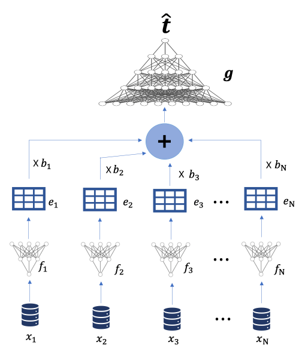

# Etri (Sleep Dataset)

> "무작위 모달 결손에 강건한 멀티모달 수면 질 예측 인공지능 기법" 논문의 구현 코드

## Development Environment

* Window 10
* GPU: NVIDIA GeForce RTX 3090


## Requirements
* **[requirements.txt](https://github.com/ehdbslee/etri/blob/main/requirements.txt)** 에서 필요한 패키지를 확인하여 설치하여 주십시오. 
* *torchsummary*의 경우 모델의 구조 및 total parameter를 확인하기 위해 사용하였으므로 필수 패키지는 아닙니다.
* cmd창(혹은 anaconda)에서 아래의 명령어로 설치할 수 있습니다. 
 
```pip install package_name=version```

## Dataset
ETRI 라이프로그 데이터셋: [Assessing Sleep Quality Using Mobile EMAs: Opportunities, Practical Consideration, and Challenges](https://ieeexplore.ieee.org/document/9667514).

2020년 수면 측정 데이터셋 중, 19개의 멀티모달 특성과, 수면의 질을 표현하는 1개의 레이블(sleep score)로 구성되어 있다.

아래의 표와 같이 특성의 modality에 따라 4개의 군집을 형성하였다.

```표 1:``` Modality에 따른 특성 분류
 |       Modality     |Features                                                                                                |
 |-----               |-----                                                                                                          |
 |Modal 1(시간 특성)   | startDt, endDt, lastUpdate                                                                                    |
 |Modal 2(가속도 특성) | wakeupduration, wakeupcount, durationtosleep, durationtowakeup                                                |
 |Modal 3(뇌파 특성)   | lightsleepduration, deepsleepduration, remsleepduration                                                       |
 |Modal 4(신체 특성)   | hr_average, hr_min, hr_max, rr_average, rr_min, rr_max, breathing_disturbances_intensity, snoring,snoringepisodecount|
 
 
-----


## Options
> ```args.exp_name:``` 'Single modal', 'ED/Single modal' 혹은 'Multi modal', 'ED/Multi modal'로 구분하여 ```Embedding Dropout```을 수행한다.

* ```Single_modal.ipynb:``` 센서의 multi-modal 전처리 없이, 각 modal 특성을 단순 접합하여 single-modal 데이터로 취급하여 훈련한 모델 구현
  * ```args.hid_dim:``` Single-modal 모델의 은닉 계층 노드 수
  * ```args.n_layer_dim:``` Single-modal 모델의 은닉 계층 수
  
* ```Multi_modal.ipynb:``` 제안하는 multi-modal 예측 구조 (그림 참조)
  * ```args.emb_dim:``` Multi-modal 전처리 모델의 은닉 계층 노드 수
  * ```args.emb_n_layer_dim:``` Multi-modal 전처리 모델의 은닉 계층 수 
  * ```args.hid_dim:``` Multi-modal 서버 예측 모델의 은닉 계층 노드 수
  * ```args.n_layer_dim:``` Multi-modal 서버 예측 모델의 은닉 계층 수


```그림 1:``` 제안하는 multi-modal 수면 질 예측 모델 구조




## Embedding Dropout

논문에서 제안하는 **Embedding Dropout** 기술은 각 코드의 ```train```, ```val```, ```test``` 함수에서 아래와 같이 ```masking_idx```로 정의하여 구현하였다.

```python
# Multi_modal과 Single_modal에서 약간의 차이는 있음
for num in range(len(len_modals)):
    masking_idx = torch.tile(torch.where(torch.empty(inputs.shape[0], 1).uniform_(0, 1) > args.threshold, 1.0, 0.0), (1,args.emb_dim)).to(device)
    
    col_inputs = inputs[:, feat_num:feat_num+len_modals[num]]
    embed_inputs += masking_idx*emb_list[num](col_inputs)
    feat_num += len_modals[num]
```


## Running the experiments
```Single_modal.ipynb```와 ```Multi_modal.ipynb``` 코드를 모두 실행하여 총 4가지 모델을 모두 훈련할 수 있다.
* 참고) 오래 걸릴 수 있으므로 훈련된 모델은 이미 저장되어 있으므로 ```experiments``` 함수의 아래 코드 부분을 주석처리한 후, 적은 epoch으로 확인하는 것을 권함. 

```python
#Single_modal.ipynb의 experiments 함수
torch.save(model.state_dict(), f"models/{args.exp_name}/[{args.threshold}, {args.hid_dim}, {args.n_layer}]model.pth")
```

```python
#Multi_modal.ipynb의 experiments 함수
torch.save(model.state_dict(), f"models/{args.exp_name}/[{args.threshold}, {args.emb_dim}, {args.emb_n_layer}, {args.hid_dim}, {args.n_layer}]model.pth")
for i, emb in enumerate(emb_list):
    torch.save(emb.state_dict(), f"models/{args.exp_name}/[{args.threshold}, {args.emb_dim}, {args.emb_n_layer}, {args.hid_dim},{args.n_layer}]embedding_{i}.pth")
```


-----


## Results

* Train하여 훈련된 Hyper Parameter는 아래의 표와 같으며, 이를 이용하여 Test 한다.

```표 2:``` 훈련 Hyper Parameters
|Params     |Single modal w/o ED  |Single modal w/ ED  |Multi modal w/o ED  |Multi modal w/ ED  |
|:-----:    |:-----:              |:-----:             |:-----:             |:-----:            |
|emb_dim    |x                    |x                   |50                  |50                 |
|emb_n_layer|x                    |x                   |1                   |1                  |
|hid_dim    |183                  |183                 |230                 |230                |
|n_layer    |3                    |3                   |3                   |3                  |
|lr         |0.01                 |0.01                |0.004641588833612777|0.001              |
|l2         |1e-06                |1e-06               |1e-07               |1e-07              |


* ```Results.ipynb``` 파일을 모두 실행하여 훈련된 4가지 모델로 성능 그래프를 도시할 수 있다.
  * Test 1) 부분을 구동하여 아래의 그래프를 얻을 수 있다.

  ```그림 2:``` 모달 결손 확률에 따른 검증 $R^2$ 성능

  

  * Test 2) 부분을 구동하여 아래의 그래프를 얻을 수 있다.

  ```그림 3:``` 특정 결손 상황의 검증 $R^2$ 성능

  

